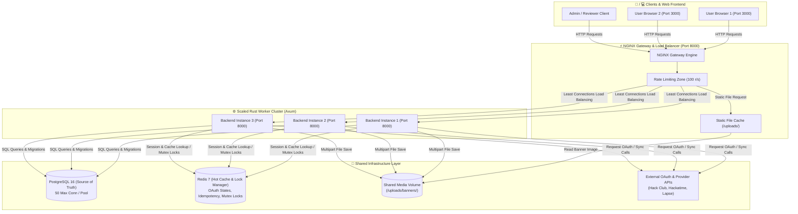
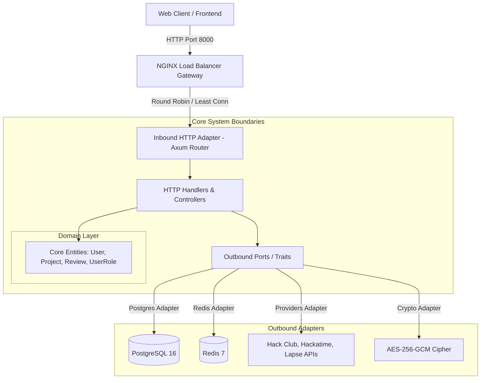

# System Architecture

This document provides a technical breakdown of the architecture, design patterns, load balancing, database schemas, and request flow of the **test-instance** platform.

---

## 🌐 End-to-End Request Flow & Load Balancer Architecture

The diagram below illustrates how client user requests flow through the **NGINX Gateway Load Balancer**, onto the **Rust Worker Cluster**, and into shared infrastructure:



---

## 🏛️ Architecture Pattern: Hexagonal (Ports & Adapters)

The Rust backend follows **Hexagonal Architecture (Ports & Adapters)** to decouple core business domain logic from external frameworks, databases, and third-party APIs.



---

## 📂 Codebase Directory Layout

```
src/
├── main.rs                               # Application entrypoint & dependency wiring
├── config.rs                             # Environment configuration loader
├── error.rs                              # Domain & API error handling
├── database.rs                           # High-concurrency SQLx Postgres connection pool
├── cache.rs                              # Redis cache & distributed lock manager
├── crypto.rs                             # AES-256-GCM token encryption
├── providers.rs                          # External API integrations (Hack Club, Hackatime, Lapse)
│
├── domain/                               # 1. CORE DOMAIN (Framework-Independent)
│   ├── mod.rs
│   ├── user.rs                           # User, SessionUser, UserRole enum (user, reviewer, admin)
│   ├── project.rs                        # Project, DashboardProject, ProjectReview, SubmitResponse
│   ├── attendance.rs                     # Attendance registration entities
│   ├── hackatime.rs                      # Hackatime project models & duration normalization
│   ├── lapse.rs                          # Lapse timelapse integration models
│   └── auth.rs                           # OAuth state & query parameters
│
├── ports/                                # 2. PORTS (System Interfaces & Traits)
│   ├── mod.rs
│   ├── db.rs                             # Database repository port type
│   ├── cache.rs                          # Cache & rate limiter port type
│   ├── providers.rs                      # External API providers port type
│   └── crypto.rs                         # Encryption cipher port type
│
└── adapters/                             # 3. ADAPTERS (Concrete Implementations)
    ├── mod.rs
    ├── http/                             # Inbound Web Adapter (Axum Framework)
    │   ├── router.rs                     # Router setup & endpoint registration
    │   ├── cookies.rs                    # HttpOnly session cookie creation & clearance
    │   ├── helpers.rs                    # Auth extraction & RBAC permission checks
    │   ├── health_handler.rs             # GET /healthz health check
    │   ├── auth_handler.rs               # Hack Club & Hackatime OAuth login/callback
    │   ├── user_handler.rs               # GET /api/v1/me user profile
    │   ├── project_handler.rs            # Project CRUD, banner upload, submission
    │   ├── review_handler.rs             # Reviewer project review endpoints
    │   └── admin_handler.rs              # Admin user & project management
    │
    └── infrastructure/                   # Outbound Infrastructure Adapters
        ├── postgres.rs                   # SQLx Postgres connection manager
        ├── redis.rs                      # Redis caching & lock adapter
        ├── providers.rs                  # Reqwest HTTP clients
        └── crypto.rs                     # AES-GCM token cipher adapter
```

---

## ⚡ Gateway & High-Concurrency Load Balancing

The system uses an **NGINX Reverse-Proxy Gateway** to handle load balancing, client rate-limiting, and static file delivery.

### Gateway Features (`nginx/nginx.conf`):
- **Port Mapping**: Listens on port `8000` (exposing `http://localhost:8000` to clients).
- **Concurrency**: Configured for `10,240` worker connections per process with `epoll` multi-accept.
- **Upstream Connection Pooling**: Keeps persistent keep-alive connections (`keepalive 64`) to backend workers.
- **Rate Limiting**: Rate limits clients at `100 r/s` with burst smoothing (`burst=200 nodelay`).
- **Static Media Delivery**: Serves `/uploads/` directly from storage volume with HTTP `Cache-Control` headers, bypassing application worker threads.
- **Multi-Replica Scaling**: Scales horizontally using Docker Compose (`docker compose up --scale backend=3 -d`).

---

## 🔐 Security & Role-Based Access Control (RBAC)

### 1. User Roles (`UserRole`)
- **`user`**: Default role. Create projects, link Hackatime, upload banners, submit for review.
- **`reviewer`**: All `user` permissions + browse and review shipped projects from `/dashboard`.
- **`admin`**: Full system control, including unshipped-project visibility and reviews, from `/admin`.

### 2. Session Management
- **HttpOnly Cookies**: Opaque UUID session tokens are issued after OAuth authentication and stored strictly in `HttpOnly; SameSite=Lax` cookies. Session hashes (`SHA-256`) are checked in PostgreSQL (`sessions` table).

### 3. At-Rest Encryption
- **AES-256-GCM**: External OAuth tokens (e.g. Hackatime access tokens) are encrypted with AES-256-GCM using random 96-bit nonces before storage in PostgreSQL (`hackatime_connections.access_token_ciphertext`).

---

## 📊 Database Schema (PostgreSQL)

```sql
users (
    id UUID PRIMARY KEY,
    email TEXT NOT NULL UNIQUE,
    first_name TEXT NOT NULL,
    last_name TEXT NOT NULL,
    hca_id TEXT UNIQUE,
    role TEXT NOT NULL DEFAULT 'user' CHECK (role IN ('user', 'reviewer', 'admin')),
    created_at TIMESTAMPTZ NOT NULL DEFAULT now(),
    updated_at TIMESTAMPTZ NOT NULL DEFAULT now()
);

projects (
    id UUID PRIMARY KEY,
    owner_id UUID NOT NULL REFERENCES users(id) ON DELETE CASCADE,
    title TEXT NOT NULL CHECK (char_length(title) BETWEEN 1 AND 120),
    description TEXT,
    banner_url TEXT,
    submission_status TEXT NOT NULL DEFAULT 'draft' CHECK (submission_status IN ('draft', 'submitted', 'under_review', 'approved', 'rejected')),
    submitted_at TIMESTAMPTZ,
    shipped_at TIMESTAMPTZ,
    created_at TIMESTAMPTZ NOT NULL DEFAULT now(),
    updated_at TIMESTAMPTZ NOT NULL DEFAULT now()
);

project_reviews (
    id UUID PRIMARY KEY,
    project_id UUID NOT NULL REFERENCES projects(id) ON DELETE CASCADE,
    reviewer_id UUID NOT NULL REFERENCES users(id) ON DELETE CASCADE,
    status TEXT NOT NULL CHECK (status IN ('pending', 'approved', 'rejected', 'changes_requested')),
    comment TEXT,
    created_at TIMESTAMPTZ NOT NULL DEFAULT now(),
    updated_at TIMESTAMPTZ NOT NULL DEFAULT now(),
    UNIQUE (project_id, reviewer_id)
);
```

---

## 📈 Performance & Tuning Specs

- **Database Connection Pool**: 50 max connections with 10 min idle connections (`PgPoolOptions`).
- **Body Upload Limit**: an 11 MiB request limit allows multipart framing while banner data is streamed and capped at 10 MiB.
- **Distributed Lock Manager**: Redis-backed mutex locks (`lock:project:{id}`) ensuring idempotent write operations under high concurrent load.
